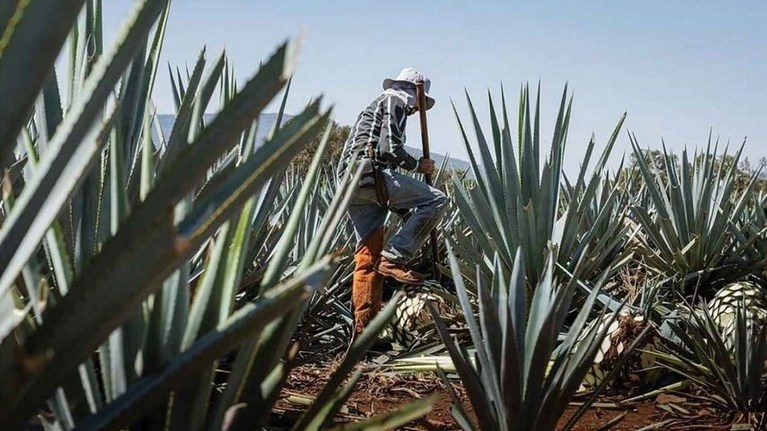

_Top-end tequilas tend to be aged añejo styles, but a new breed of premium blancos is putting agave centre-stage, while cristalinos are introducing a new generation of drinkers to another side of tequila._

You might, in seeking out a special bottle of tequila, gravitate towards those amber-coloured, long-aged luxury expressions – añejos and extra añejos – in their fancy packaging. But a growing number of noteworthy blanco tequilas are doing things differently, without an oak cask in sight. Meanwhile, cristalinos – aged expressions that are filtered to remove their colour – are also on the rise. Together, they’re changing the face of premium crystal-clear tequila.

Read more: [Decanter](https://www.decanter.com/spirits/colourless-tequilas-clear-contenders-537436/)
